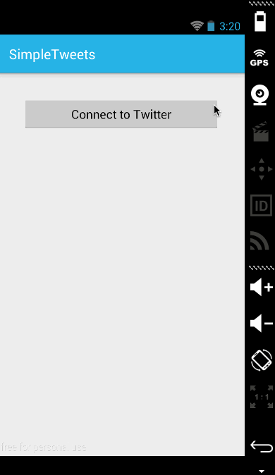

# MySimpleTweets

This is an Android application developed while learning about Android in Workshop. It is an app used to log in to Twitter, view Timeline and also send Tweets to the followers using [Twitter API](https://dev.twitter.com/rest/public). Tutorial provided by thecodepath.

Time spent: 8 hours spent in total

Week 3 user stories:

 * [x] Required: User can sign in to Twitter using OAuth login
 * [x] Required: User can view the tweets from their home timeline
 * [x] Required: User should be displayed the username, name, and body for each tweet
 * [x] Required: User should be displayed the relative timestamp for each tweet "8m", "7h"
 * [x] Required: User can view more tweets as they scroll with infinite pagination
 * [x] Optional: Links in tweets are clickable and will launch the web browser
 * [x] Required: User can compose a new tweet
 * [x] Required: User can click a “Compose” icon in the Action Bar on the top right
 * [x] Required: User can then enter a new tweet and post this to twitter
 * [x] Required: User is taken back to home timeline with new tweet visible in timeline
 * [x] Optional: User can see a counter with total number of characters left for tweet

 * [ ] Advanced: User can refresh tweets timeline by pulling down to refresh (i.e pull-to-refresh)
 * [ ] Advanced: User can open the twitter app offline and see last loaded tweets
 * [ ] Advanced: User can tap a tweet to display a "detailed" view of that tweet
 * [ ] Advanced: User can select "reply" from detail view to respond to a tweet
 * [ ] Advanced: Improve the user interface and theme the app to feel "twitter branded"
 * [ ] Bonus: User can see embedded image media within the tweet detail view
 * [ ] Bonus: Compose activity is replaced with a modal overlay
 
Week 4 user stories:

* [x] Required: User can switch between Timeline and Mention views using tabs.
* [x] Required:     User can view their home timeline tweets.
* [x] Required:     User can view the recent mentions of their username.
* [x] Required: User can navigate to view their own profile
* [x] Required:     User can see picture, tagline, # of followers, # of following, and tweets on their profile.
* [x] Required: User can click on the profile image in any tweet to see another user's profile.
* [x] Required:     User can see picture, tagline, # of followers, # of following, and tweets of clicked user.
* [x] Required:     Profile view should include that user's timeline
* [ ] Optional: User can view following / followers list through the profile
* [x] Required: User can infinitely paginate any of these timelines (home, mentions, user) by scrolling to the bottom
* [ ] Advanced: Robust error handling, check if internet is available, handle error cases, network failures
* [ ] Advanced: When a network request is sent, user sees an indeterminate progress indicator
* [ ] Advanced: User can "reply" to any tweet on their home timeline
* [ ] Advanced: The user that wrote the original tweet is automatically "@" replied in compose
* [ ] Advanced: User can click on a tweet to be taken to a "detail view" of that tweet
* [ ] Advanced: User can take favorite (and unfavorite) or reweet actions on a tweet
* [ ] Advanced: Improve the user interface and theme the app to feel twitter branded
* [ ] Advanced: User can search for tweets matching a particular query and see results
* [ ] Bonus: User can view their direct messages (or send new ones)

Notes:

Walkthrough of all user stories:

GIF created with [LiceCap](http://www.cockos.com/licecap/).
